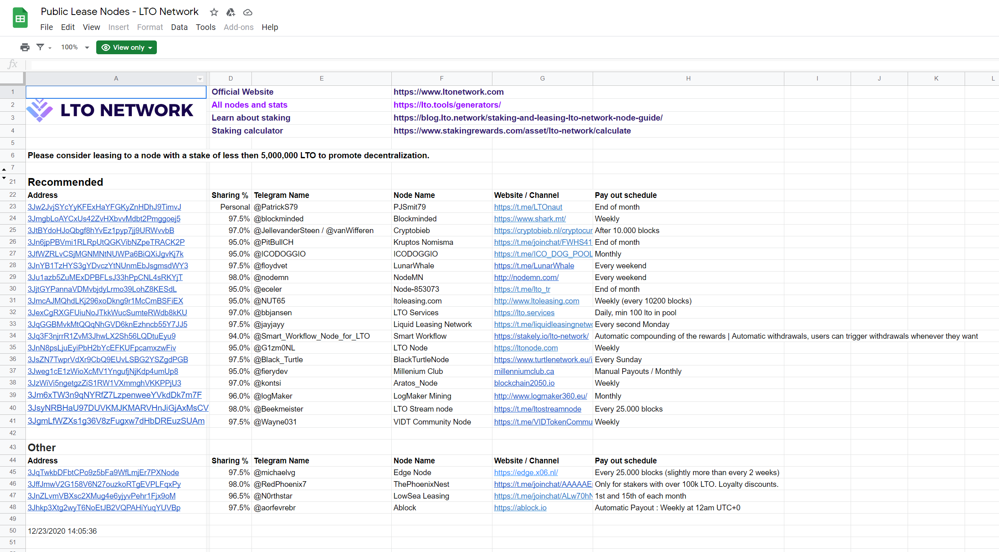
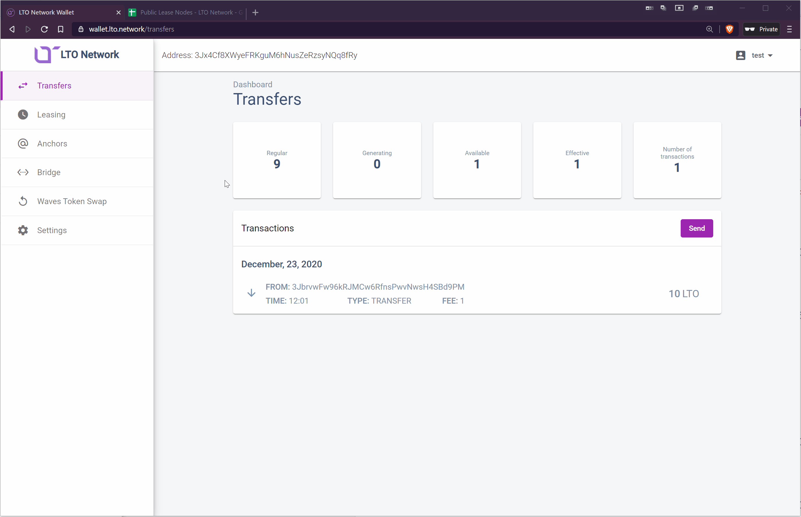

# Starting a new lease

## Requirements

1. An LTO wallet. 
2. A balance of at least 2 LTO \(but more is recommended\) 

## Step 1 - Choose a leasing node

LTO Network has more than 50 nodes running on it, but not all nodes pay back blockrewards. The ones that do are called "Leasing Nodes" and a list is maintained by the LTO Core [team right here: ](https://docs.google.com/spreadsheets/d/1R9OPQxW9dD9anq217ffm9sXINV_xKTNNaiHcY_eOWmw/edit?usp=sharing)Copy the address. 


All nodes have an equal chance of finding a block, the only differences are in fees they take, and payout frequency. Some offer extra's like a dedicated Telegram group or contribute to the community in some way or another. Check out the telegram for more info on these differences. 


## Step 2 - Select "Leasing" in your LTO wallet.

Open your wallet on https://wallet.lto.network if you haven't done so already, and select "Leasing".

## Step 3 - Select "Start Lease" and fill in

**Recipient:**    Fill in the address of the Leasing Node you chose in Step 1

**Amount:**       Fill in the amount you want to lease. **Make sure you keep at least 1 LTO for the leasing fee**

## Step 4: Profit!

After confirming the lease, your lease will take 1000 blocks to activate. A block is forged every minute approximately, so this should take about 16 to 17 hours. If you cancel, your funds are available instantly. Your Leasing Node will pay you out to this address \(check the list to see at which interval your Leasing Node pays out rewards\). If you want to lease those rewards, you can just make a new lease for these new LTO. 

